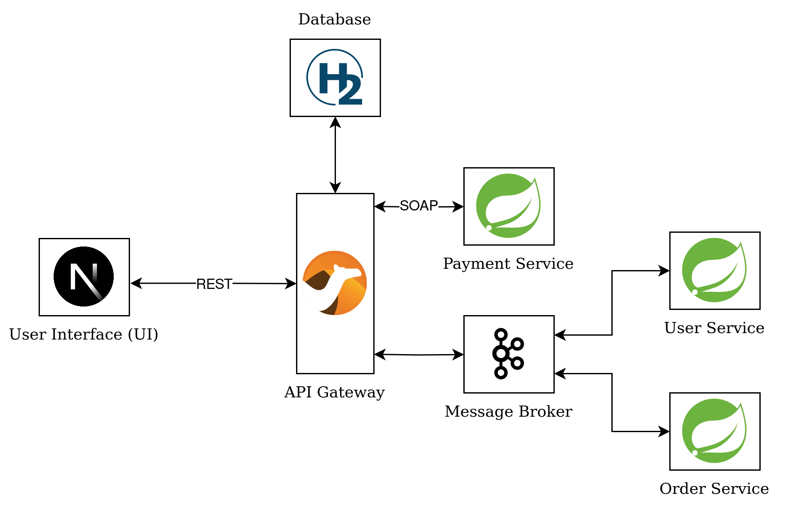

# Microservice Architecture Project

This repository contains the university assignment. It was created for educational purposes only.

## Running
```sh
docker compose build
docker compose up
firefox localhost:3000
```

## System Architecture Diagram


## Kafka topics
- `input-topic` (OnlineOrderRequest)
- `output-topic-user` (UserServiceResponse)
- `output-topic-order` (OrderServiceResponse)
- `input-compensation-topic` (CompensationRequest)
- `output-compensation-topic` (CompensationResponse)

## API docs
OpenAPI 3 documentation is available at
```
localhost:8083/api/docs
```

## Example requests

### 1. Successful scenario
Prepare a payload
```sh
payload='{
    "id": null,
    "payment": {
        "cardNumber": "1234-5678-1234-5671",
        "paymentId": "jg73bzlahf63vc9zfg",
        "amount": 500
    },
    "order": [
        {
            "name": "milk",
            "amount": 2
        },
        {
            "name": "yoghurt",
            "amount": 1
        }
    ],
    "user": {
        "email": "ian@gmail.com",
        "firstName": "Ian",
        "lastName": "Kowalski"
    }
}'
```
Submit a new job
```sh
response=$(curl -X POST -H "Content-Type: application/json" --data "$payload" localhost:8083/api/shopping 2> /dev/null)
echo $response
```

Check for status (polling)
```sh
uuid=$(echo $response | grep -oP '(?<="id":").*?(?=")')
echo $(curl -H "Content-Type: application/json" "localhost:8083/api/shopping/$uuid" 2> /dev/null)
```

### 2. Failed scenario (with saga compensation)
Prepare a payload
```sh
payload='{
    "id": null,
    "payment": {
        "cardNumber": "1234-5678-1234-5671",
        "paymentId": "jg73bzlahf63vc9zfg",
        "amount": 500
    },
    "order": [
        {
            "name": "beer",
            "amount": 2
        },
        {
            "name": "yoghurt",
            "amount": 1
        }
    ],
    "user": {
        "email": "ian@gmail.com",
        "firstName": "Ian",
        "lastName": "Kowalski"
    }
}'
```
Submit a new job
```sh
response=$(curl -X POST -H "Content-Type: application/json" --data "$payload" localhost:8083/api/shopping 2> /dev/null)
echo $response
```

Check for status (polling)
```sh
uuid=$(echo $response | grep -oP '(?<="id":").*?(?=")')
echo $(curl -H "Content-Type: application/json" "localhost:8083/api/shopping/$uuid" 2> /dev/null)
```
<br>

>*If you ever doubt the quality of your code, take a look at this project.*  
*~ No philosopher has ever said*